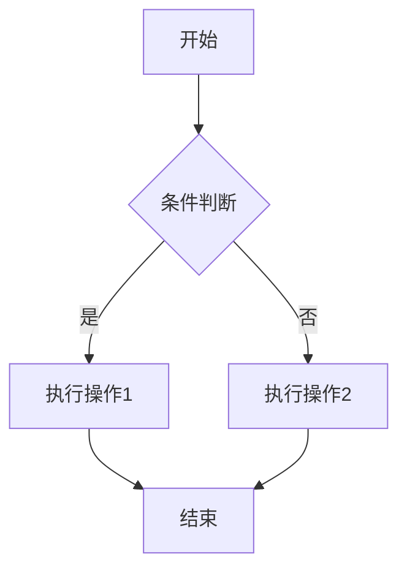
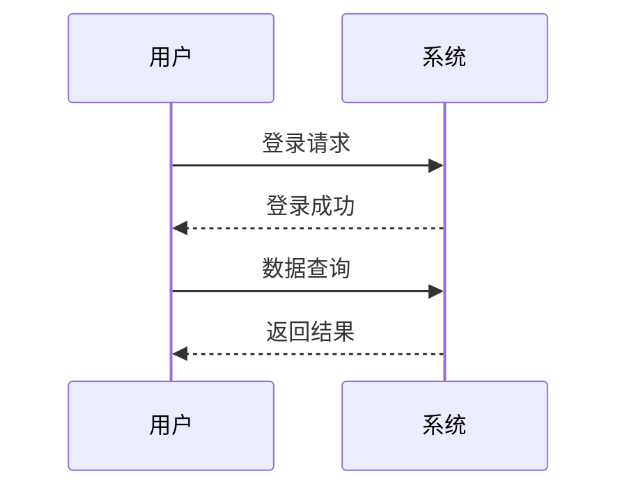
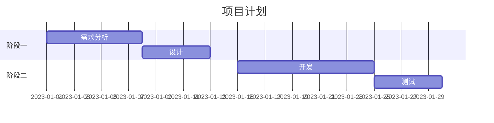
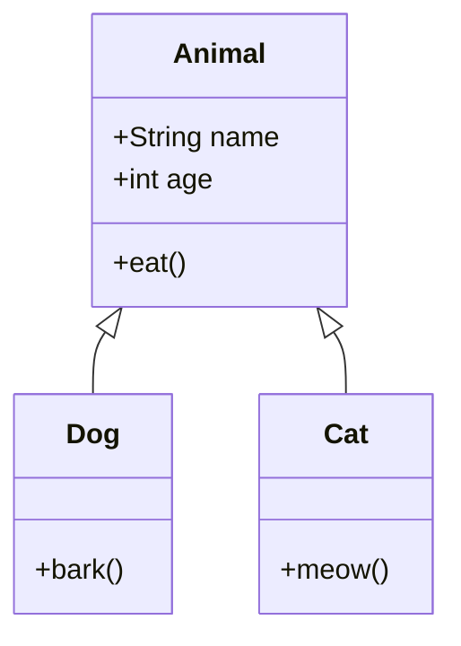

# Markdown 功能测试文档


这是一个测试 Markdown 所有功能的文档，包含各种语法元素。

## 1. 基础文本格式

**粗体文本**  
*斜体文本*  
~~删除线文本~~  
`行内代码`  
> 引用文本

## 2. 标题层级

# H1 标题
## H2 标题
### H3 标题
#### H4 标题
##### H5 标题
###### H6 标题

## 3. 列表

### 无序列表
- 项目一
  - 子项目
  - 子项目
- 项目二
- 项目三

### 有序列表
1. 第一项
2. 第二项
3. 第三项

### 任务列表
- [x] 完成文档结构
- [ ] 添加数学公式
- [ ] 测试图表功能

## 4. 链接与图片

https://www.baidu.com

!https://via.placeholder.com/150 "占位图片"

## 5. 表格

| 姓名 | 年龄 | 职业 |
|------|------|------|
| 张三 | 28   | 工程师 |
| 李四 | 32   | 设计师 |
| 王五 | 25   | 学生 |

## 6. 代码块

### 行内代码
`console.log("Hello World")`

### 代码块
```javascript
function greet(name) {
  return `Hello, ${name}!`;
}
```

```python
def factorial(n):
    if n == 0:
        return 1
    else:
        return n * factorial(n-1)
```

## 7. 数学公式

### 行内公式
勾股定理：$a^2 + b^2 = c^2$

### 块级公式
$$
\int_a^b f(x)dx = F(b) - F(a)
$$

### 多行公式
$$
\begin{aligned}
\nabla \times \vec{E} &= -\frac{\partial \vec{B}}{\partial t} \\
\nabla \times \vec{H} &= \vec{J} + \frac{\partial \vec{D}}{\partial t} \\
\nabla \cdot \vec{D} &= \rho \\
\nabla \cdot \vec{B} &= 0
\end{aligned}
$$

## 8. 图表

### Mermaid 流程图


### Mermaid 序列图


### Mermaid 甘特图


### Mermaid 类图


## 9. 脚注

这是一个带有脚注的示例。这是另一个脚注。

: 这是第一个脚注的内容。
: 这是第二个脚注的内容，可以包含更长的解释和说明。

## 10. 分隔线

---

## 11. HTML 元素

<details>
<summary>点击展开详情</summary>
这里是被折叠的内容，可以包含Markdown语法：

- 列表项
- 另一个列表项

```python
print("Hello from HTML折叠内容")
```
</details>

## 12. 表情符号

:smile: :heart: :rocket: :thumbsup:

## 13. 特殊字符转义

\*不需要斜体的星号\*  
\# 不需要标题的井号

## 14. 行内HTML

<span style="color:red">红色文本</span>

<kbd>Ctrl</kbd>+<kbd>C</kbd> 复制

## 15. 注释

<!-- 这是一个注释，不会在渲染后显示 -->

## 16. 定义列表

术语一
: 定义一

术语二
: 定义二
: 第二个定义

## 17. 任务进度

进度条示例：

[50% complete] {.progress}

## 18. 内嵌内容

### YouTube 视频
https://img.youtube.com/vi/dQw4w9WgXcQ/0.jpg](https://www.youtube.com/watch?v=dQw4w9WgXcQ)

## 19. 数学符号表

| 符号 | LaTeX 代码 |
|------|------------|
| α    | `\alpha`   |
| β    | `\beta`    |
| ∑    | `\sum`     |
| ∫    | `\int`     |
| √    | `\sqrt`    |
| ≠    | `\neq`     |
| ≈    | `\approx`  |
| ∞    | `\infty`   |

---

这个文档展示了Markdown的大部分功能，包括文本格式、列表、表格、代码块、数学公式、图表绘制等。不同的Markdown解析器可能支持的功能有所不同。